# Le design pattern "Listener" / le patron de conception "observateur".

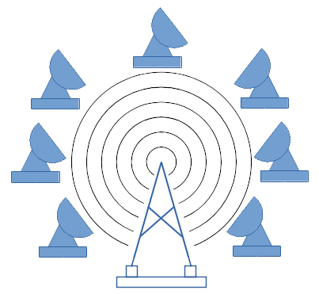

## Avant-propos
Cet article et le code l'accompagnant ont pour objectif de faire découvrir et comprendre le design pattern listener.
Ce design pattern est d'usage très courant et se trouve vraiment partout, même dans les librairies de base de Java.

L'approche de cet article consiste à partir d'un exemple concret, où un problème est identifié, d'aboutir à la 
re-découverte du design pattern listener.

Le code qui illustre l'article est accessible via github. 
Il se concentre sur la problématique traitée et implémente uniquement les fonctionnalités nécessaires à la compréhension 
de l'article.


## V1 : le début de la mauvaise pente
Durant le développement d'une application de type client riche (ie. des IHMs sans le techno web), il est demandé de gérer
une connexion à un serveur.
Il est décidé de placer les paramètres de configuration de la connexion dans un fichier de configuration.
Ce fichier est lu par une instance de **ConfigurationManager**.
Le contenu du fichier de configuration est placé dans une instance de **Configuration**, un JavaBean.
Puis cet objet est transmis à l'instance de type **Network** afin d'établir la connexion au serveur.

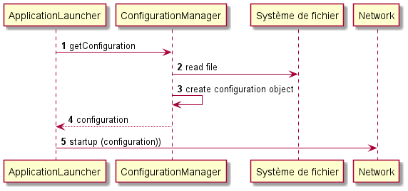

D'un point de vue conception, les dépendances entre les classes sont :
* **Configuration** n'a aucune dépendance,
* **Network** dépend de **Configuration**,
* **ConfigurationManager** dépend de **Configuration**.

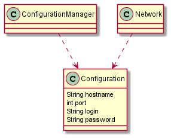

Ainsi les couplages forts sont cohérents et les couplages entre objets métiers distincts sont lâches.
Ce qui est très bien.


## V2 : l'application à chaud des changements de configuration 
Une évolution demandée est la prise en compte à chaud d'un changement de configuration.
L'idée est que le fichier de configuration doit être consulté régulièrement pour vérifier s'il a été mis à jour.
Lorsqu'il est mis à jour, l'application doit lire cette nouvelle configuration et l'appliquer à la connexion en cours.

Une méthode **scanConfiguration** est ajoutée à la classe **ConfigurationManager**.
Cette méthode, exécutée régulièrement, va vérifier l'état du fichier de configuration (rôle de la méthode 
**configurationHasChanged()**) et, au besoin, lire le fichier (rôle de la méthode **loadConfiguration()**) et demander à 
l'instance de **Network** de se reconnecter au serveur avec les paramètres de la nouvelle configuration (rôle de la 
méthode **fireConfigurationChange()**).

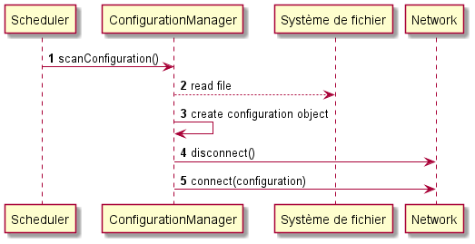

D'un point de vue conception, les dépendances entre les classes sont :
* **Configuration** n'a aucune dépendance,
* **Network** dépend de **Configuration**,
* **ConfigurationManager** dépend de **Network** et de **Configuration**.

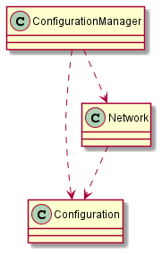


La dernière dépendance, entre **ConfigurationManager** et **Network**, introduit un couplage fort entre ces deux
notions, qui sont pourtant distinctes.
Ainsi, quand la classe **Network** évoluera, la classe **ConfigurationManager** sera à recompiler.
Pour l'instant, ce n'est pas important, mais si dans le futur le code de l'application s'étoffe suffisamment, il
pourrait être utile de découper l'application entre différentes librairies (Fichiers JAR).
Cette dépendance obligera à mettre dans la même librairie le code de gestion de la configuration et celui de la gestion
des échanges réseau.

Nous n'en sommes pas là, le code pourra être refactorisé le moment venu.


## V3 : un nouvel observateur
Une nouvelle évolution demandée est d'afficher, sur la barre de status de l'IHM, le nom du serveur auquel est connecté 
l'application.
La gestion de cette barre de status est implémentée dans la classe **StatusBar**.

Cette évolution est simple, il suffit d'ajouter un setter de **StatusBar** à la classe **ConfigurationManager** et 
d'appeler la méthode adéquate lorsque le fichier de configuration est mise à jour.

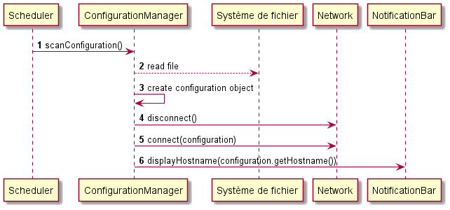


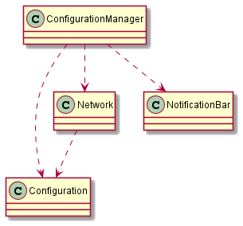


Alors, tout est bien dans le meilleur des mondes ?
Pas tout à fait, car une dépendance a été ajoutée à la classe **ConfigurationManager** et celle-ci dépend à présent 
aussi de **StatusBar**. 
Ainsi **ConfigurationManager** dépend de deux classes qui ne lui sont pas directement liés d'un point de vue 
fonctionnel/métier : la gestion des échanges réseau et la gestion de la barre de status.
Ces dépendances inadéquates risquent de poser un problème à terme.


## V4 : encore un nouvel observateur
Une nouvelle évolution demandée est de pouvoir suivre au travers de la supervision les changements du nom du serveur et
du login de l'utilisateur.
La supervision est gérée par la classe **Supervision**.

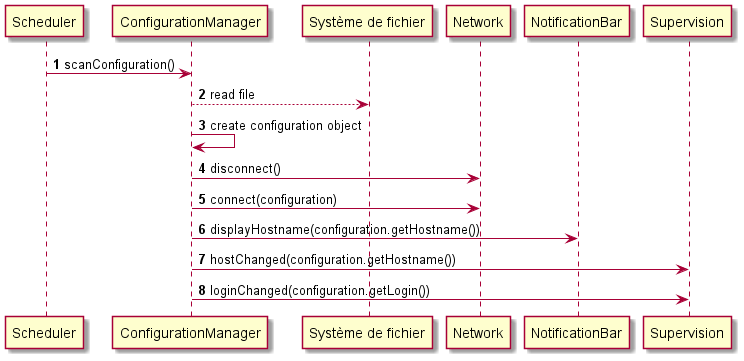


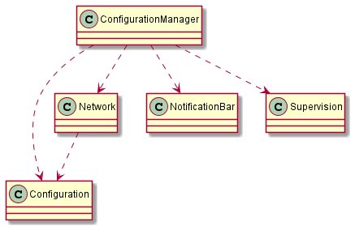


L'implémentation de cette évolution est effectuée comme précédemment, par l'ajout d'une méthode setter à la classe
**ConfigurationManager** et l'ajout d'appels à **Supervision** dans la méthode **fireConfigurationChange()**.
La conséquence de cela est de rajouter une dépendance de **ConfigurationManager** à une classe fonctionnelle 
uniquement pour des raisons techniques.


## V5 : là où l'architecte craque
L'architecte logiciel n'est pas du tout satisfait de la classe **ConfigurationManager**.
1. Celle-ci est dépendante de concepts métiers totalement distincts (réseau, composant graphique, supervision), 
imposant à ces trois concepts de cohabiter, même par exemple lors d'un découpage de l'application en librairies.
2. Celle-ci s'adresse de manière spécifique (ie via les méthodes **displayHostname()**, **hostChanged()** et 
**userChanged()**) à des objets qui elle fournit pourtant le même service, à savoir fournir la même information contenue 
dans **Configuration**.
3. Celle-ci contient du code qui peut prêter à confusion dans la méthode **fireConfigurationChange()**.
Ainsi, celle-ci pilote la connexion au server distant, alors qu'à la base, elle ne devrait qu'informer la classe 
**Network** d'un changement de configuration, pas de savoir qu'il faut se déconnecter et se reconnecter au server.
4. Celle-ci doit évoluer à chaque fois qu'un nouvel objet souhaite est prévenu d'un changement de configuration alors 
que son fonctionnement reste *strictement* le même : lire un fichier, le convertir en objet Java et notifier les 
objets intéressés.

### Réflexion sur la situation
Dans un premier temps, l'architecte soit définir précisément le rôle **ConfigurationManager**, à savoir :
* surveiller la mise à jour du fichier de configuration, 
* lire le contenu du fichier de configuration et le convertir en objet de type **Configuration**,
* informer, de la mise à jour de la configuration, les objets qui le souhaitent

C'est le troisième point qui pose problème. 

### Définition de la méthode d'échange
Dans un deuxième temps, l'architecte décide d'unifier les échanges avec les classes métier (**Network**,
**StatusBar** et **Supervision**) en définissant une seule et même méthode dans chaque classe requérant la notification
de mise à jour d'un changement de configuration.
La signature de la méthode sera **void onConfigurationChanged(Configuration)**.
Cela représente son objectif : notifier la classe appelée d'un changement de configuration.
C'est à chaque classe métier d'implémenter d'agir en conséquence à la réception du changement de configuration.

La même signature de méthode dans chaque classe métier règle les points 2 et 3, restent les points 1 et 4.


Cela donne :
```java
public class ConfigurationManager {
    private void fireConfigurationChange() {
        if (network != null) 
            network.onConfigurationChanged(configuration);
        if (statusBar != null)
            statusBar.onConfigurationChanged(configuration);
        if( supervision != null) 
            supervision.onConfigurationChanged(configuration);
    }
    // Suite de l'implémentation [...]
}

public class Network {
    public void onConfigurationChanged(Configuration configuration) {
        disconnect();
        connect(configuration);
    }
    // Suite de l'implémentation [...]
}


public class StatusBar {

    public void onConfigurationChanged(Configuration configuration) {
        displayHostname(configuration.getHostname());
    }
    // Suite de l'implémentation [...]
}


public class Supervision {

    public void onConfigurationChanged(Configuration configuration) {
        hostChanged(configuration.getHostname());
        loginChanged(configuration.getLogin());
    }
    // Suite de l'implémentation [...]
}
```


### Définition de l'interface d'échange
Comme il est décidé que chaque classe métier doit fournir la même méthode pour être informé des mises à jour, cela
constitue, de fait, une interface.
Celle-ci sera nommée **ConfigurationListener** (ie. observateur de la configuration) et elle contiendra la méthode 
définie précédemment.
Cela donne :
```java
public interface ConfigurationListener {
    void onConfigurationChanged(Configuration configuration);
}
```

De ce fait chaque classe devra implémenter cette interface et la classe **ConfigurationManager** pourra interagir avec 
les classes métiers via cette interface commune.
Cela donne :
```java
public class Network implements ConfigurationListener {
    // Suite de l'implémentation [...]
}

public class StatusBar implements ConfigurationListener {
    // Suite de l'implémentation [...]
}

public class Supervision implements ConfigurationListener {
    // Suite de l'implémentation [...]
}

public class ConfigurationManager {
    private ConfigurationListener network;
    private ConfigurationListener statusBar;
    private ConfigurationListener supervision;
    // Suite de l'implémentation [...]
}
```
Les classes métier n'apparaissant plus dans la classe **ConfigurationManager**, il n'y a plus de dépendances entre la
classe **ConfigurationManager** et les classes métiers.
Ainsi ce refactoring résout le point 1.


### Regroupement des observateurs
La classe **ConfigurationManager** contient différents champs de type **ConfigurationListener** qui ont exactement le 
même traitement au même moment, à savoir l'appel à la méthode **onConfigurationChanged()** dans la méthode
**fireConfigurationChange()**.
Il n'y a donc aucune raison de les distinguer et encore moins de faire apparaître la nature de chaque classe les 
implémentant (network, statusBar et supervision).
De ce fait, il est possible de regrouper ces champs en une liste unique, de remplacer les setters associés par une
méthode d'ajout et transformer l'implémentation de **fireConfigurationChange()** en un parcours de la liste pour 
appeler la méthode **onConfigurationChanged()**.

De ce fait chaque classe devra implémenter cette interface et la classe **ConfigurationManager** pourra interagir avec
les classes métiers via cette interface commune.
Cela donne :
```java
public class ConfigurationManager {

    private final List<ConfigurationListener> listeners = new ArrayList<>();

    public void addConfigurationListener(ConfigurationListener listener) {
        if (!listeners.contains(listener))
            listeners.add(listener);
    }

    public void removeConfigurationListener(ConfigurationListener listener) {
        listeners.remove(listener);
    }

    private void fireConfigurationChange() {
        for (ConfigurationListener listener : listeners) {
            listener.onConfigurationChanged(configuration);
        }
    }
    // Suite de l'implémentation [...]
}


public class ApplicationLauncher {

    private final Network network = new Network();
    private final StatusBar statusBar = new StatusBar();
    private final Supervision supervision = new Supervision();

    private final ConfigurationManager configurationManager = new ConfigurationManager();

    public void initialize() {
        configurationManager.addConfigurationListener(network);
        configurationManager.addConfigurationListener(statusBar);
        configurationManager.addConfigurationListener(supervision);
    }
    // Suite de l'implémentation [...]
}
```
Avec ce dernier refactoring, la classe **ConfigurationManager** est totalement indépendante des classes métiers et si
de nouveaux objets métiers souhaitent être informés des changements de configuration, il suffira que leur classe 
implémente l'interface **ConfigurationListener** et de les ajouter à l'instance **ConfigurationManager** via la méthode
**addConfigurationListener()**.
Ce refactoring permet de résoudre le point 4.


Finalement, les 4 points identifiés au début du chapitre sont résolus, l'objectif du refactoring est atteint.
Et surtout, cela rend heureux l'architecte logiciel, ce qui est toujours une bonne chose... 

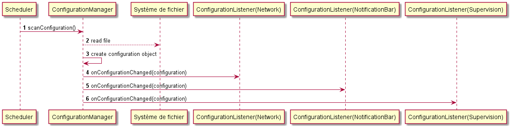


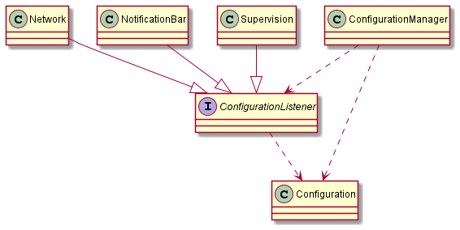


## V6 : un dernier refactoring pour la route
Le code refactoré fonctionne correctement, cependant, il y a un cas où le code pourrait moins bien fonctionner : que
se passe-il si la classe **ConfigurationManager** est appelée par différents threads et non plus en séquentiel ?
Cela peut poser des problèmes de concurrence d'accès à la liste des listeners.

Pour résoudre ce problème, il suffit de protéger les accès en écriture mais aussi en lecture à la liste des listeners.
Cela donne :
```java
public class ConfigurationManager {

    private final List<ConfigurationListener> listeners = new ArrayList<>();

    public void addConfigurationListener(ConfigurationListener listener) {
        synchronized (listeners) {
            if (!listeners.contains(listener))
                listeners.add(listener);
        }
    }

    public void removeConfigurationListener(ConfigurationListener listener) {
        synchronized (listeners) {
            listeners.remove(listener);
        }
    }
    
    private void fireConfigurationChange() {
        for (ConfigurationListener listener : cloneListeners()) {
            listener.onConfigurationChanged(configuration);
        }
    }

    private List<ConfigurationListener> cloneListeners() {
        synchronized (listeners) {
            return new ArrayList<>(listeners);
        }
    }
    // Suite de l'implémentation [...]
}
```
L'utilisation du mot-clé **synchronized** dans les méthodes **addConfigurationListener()** et
**removeConfigurationListener** permet d'éviter que 2 threads accèdent au bloc en même temps.

Pour la méthode **fireConfigurationChange()**, le mot clé pourrait être également utilisé mais, du fait que le temps
d'exécution du code de la boucle peut être long, cela peut dégrader les performances de l'application.
Pour éviter cette dégradation de performances, une autre approche est choisie en identifiant et en minimisant la portion
de code où il faut protéger l'accès à la liste des listeners.
En l'occurrence, c'est la boucle elle-même qui est à protéger, car elle utilise en continu le champ **listeners**.
Pour éviter de protéger la boucle, il suffit d'effectuer la boucle sur une liste non partagée qui contiendrait les 
mêmes éléments que le champ **listener**.
Pour cela, rien de plus simple, il faut en dupliquer le contenu, ce qui est l'objet de la méthode **cloneListeners()**.


## Debrief avant de reprendre la route
Cet exemple d'évolutions et de refactorings successifs permet d'illustrer la nécessité de mettre en place une 
conception pour résoudre une série de problèmes identifiés dans le code, mais aussi d'éviter qu'ils ne se reposent plus
tard.
Ainsi les bénéfices du refactoring constitant à introduire le design-pattern listener sont : 
* couplage lâche entre le producteur des données (**ConfigurationManager**) et les consommateurs 
(**ConfigurationListener**),
* pas modification du code à chaque ajout d'un consommateur,
* pas d'appels spécifiques pour transférer l'information aux consommateurs,
* pas de pilotage de consommateurs

D'un point de vue UML, cela donne :

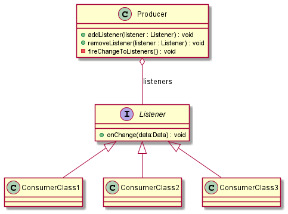


Ce design-pattern se retrouve également dans les librairies Java:
* les classes [Observer](https://docs.oracle.com/en/java/javase/17/docs/api/java.base/java/util/Observer.html)  et
[Observable](https://docs.oracle.com/en/java/javase/17/docs/api/java.base/java/util/Observable.html) qui sont devenues
obsolètes depuis Java 9.
* les classes [EventListener](https://docs.oracle.com/en/java/javase/17/docs/api/java.base/java/util/EventListener.html)
et [EventListenerProxy](https://docs.oracle.com/en/java/javase/17/docs/api/java.base/java/util/EventListenerProxy.html)
* et tout un ensemble de classes liées aux IHMs telles que 
[ChangerListener](https://docs.oracle.com/en/java/javase/17/docs/api/java.desktop/javax/swing/event/ChangeListener.html)

Bref, ce design-pattern est présent partout, alors ne vous privez pas pour l'employer.

Sur ce, bonne route pour la suite !


## License
L'article et le code sont sous la licence CC BY-SA 4.0.
Le code source est disponible [ici](https://github.com/gwenlr/article_listener_design_pattern)
